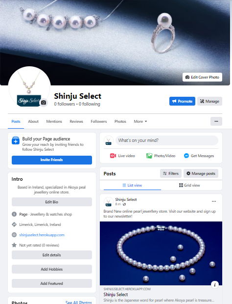
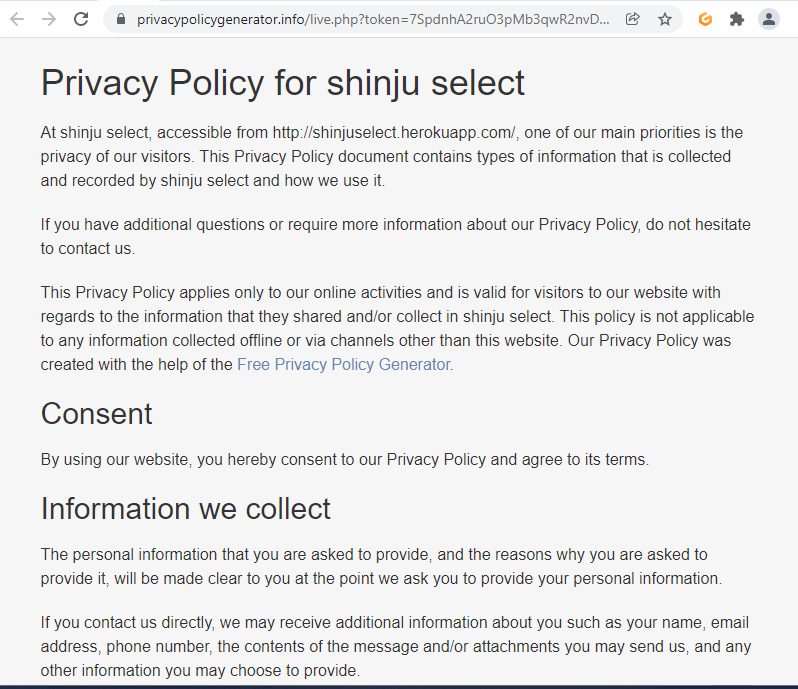
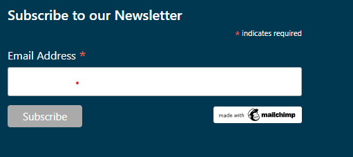
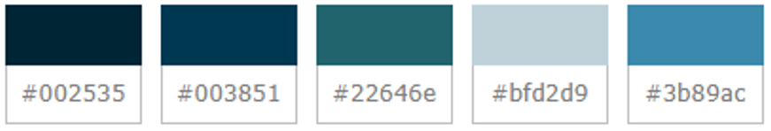
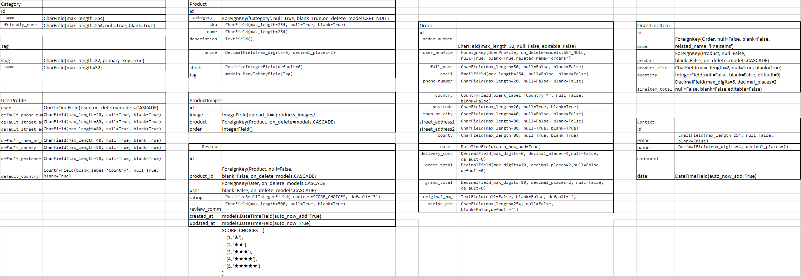
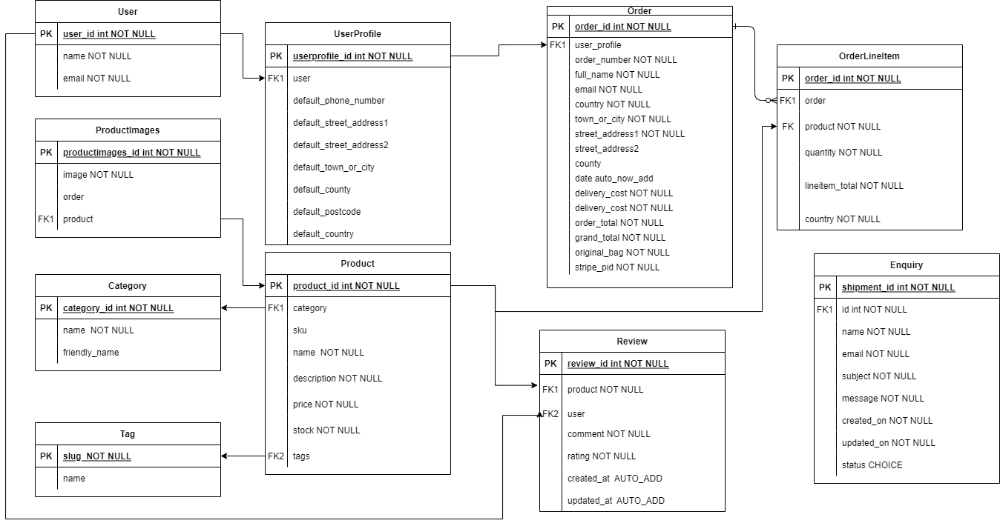

# Shinju Select 

Shinju Select is an online shop specialising in highest quality Akoya Pearl Jewellery sourced directly from Japan

View the live project here. [Shinju Select](https://shinjuselect.herokuapp.com/)

This site is created as a portfolio project for Code Institute's Software Development course. Please note that the course duration for my group, coding career for women, is shortened by 3 months.

This website is for educational purposes only and card payment details should be entered as below.

  * To make payment with stripe function, please enter following details: 
    * Card number : 4242 4242 4242 4242
    * Date : Any  future date
    * CVC :  Any 3 numbers

## Table of Contents

- [Shinju Select](#shinju-select)
  * [1. User experience (UX)](#1-user-experience--ux-)
    + [1.1 The purpose of this site](#11-the-purpose-of-this-site)
    + [1.2 Target Audience](#12-target-audience)
    + [1.3 User Goals](#13-user-goals)
    + [1.4 Site Owners Goals](#14-site-owners-goals)
    + [1.5 USER STORIES](#15-user-stories)
    + [1.6 STRATEGY](#16-strategy)
      - [Business Model](#business-model)
      - [SEO](#seo)
    + [1.7 SCOPE](#17-scope)
      - [Custom Model](#custom-model)
    + [1.8 Structure](#18-structure)
    + [1.9 SKELETON](#19-skeleton)
    + [1.10 SURFACE/ Design](#110-surface--design)
  * [2. Information Architecture](#2-information-architecture)
  * [3 Features](#3-features)
    + [3.1 Existing Features](#31-existing-features)
      - [Elements on every page](#elements-on-every-page)
      - [Pages](#pages)
    + [3.2 Features Left to Implement](#32-features-left-to-implement)
  * [4 Technologies used](#4-technologies-used)
  * [5 Testing](#5-testing)
    + [Errors encountered during development](#errors-encountered-during-development)
    + [Known error present:](#known-error-present-)
    + [Validating code](#validating-code)
  * [6 Deployment](#6-deployment)
    + [Deployment procedures](#deployment-procedures)
  * [7. Credit](#7-credit)
  * [8. Acknowledgment](#8-acknowledgment)

<small><i><a href='http://ecotrust-canada.github.io/markdown-toc/'>Table of contents generated with markdown-toc</a></i></small>

## 1. User experience (UX)

### 1.1 The purpose of this site 

This site is created to sell and promote Akoya pearl jewellery produced in Japan.
Akoya pearls from Japan are known for an excellent quality and tresured by many for generations. This online store specialises in this excellent quality pearl jewellery selected and sourced directly from the area where harvest of Akoya pearl is most prelevant in Japan.

### 1.2 Target Audience

This online store is targeted to a high end  market for users who seek highest quality jewellery to last not only a life time but generations after.
Target audience includes shoppers searching for jewellery for their wedding or other special occasions, also for those who are searching for a special treat for themselves or looking for a very distinctive gift to someone special.

### 1.3 User Goals

**First time site visitors would like to**

 * Find out the purpose of the site and how to use it
 * Find out what products the site is specialized in
 * Find out why the products on this site stand out
 * See what products are available
 * See the preview of the service before they decide to purchase goods
 * See if they provide the service in my area (i.e. Delivery availability)

**Returning registered users would like**

  * Easily login and log out
  * Quickly navigate to the pages or items they wish to seek
  * See/edit my profile 
  * View the history of my order
  * Quickly find out what items have been added recently

### 1.4 Site Owners Goals

  In addition to user goals, following considerations were taken into account as a site owner to provide a good service

 * Non-registered site visitors have restricted access to the appropriate pages
 * All the site elements reflect the user's login status
 * Restrict the pages to user's account status accordingly
 * Provide the message as feedback when site visitors take any actions within the site

### 1.5 USER STORIES

Issue No. | Title | User story | Acceptance criteria | Implemented
----------|-------|------------|---------------------|-------
#01 | Create Landing page | As a Site owner I can provide clear purpose of the site so that new and returning users know what the web site is about and how to use it | State clear purpose of the site in the page and no confusing elements for site visitors | &#9745;
#02 | View a list of the products | As a shopper I would like to view a list of the products so that I can select some to purchase | Create product list page with clear display of the products | &#9745;
#03 | View specific categry of products | As a shopper I would like to view specific category of products so that I can quickly find products I'm interested in without having to search through all products | Create category buttons to filter by category and ensure the appropriate items are displayed | &#9745;
#04 | View individual product details | As a shopper I would like to view individual product details so that I can identify the price, description, product rating, product image and available sizes | Product detail page to display the product info in details and button to add the item in the bag with quantity and sizing options where applicable | &#9745;
#05| Filter/Tag special items | As a shopper I would like to find out special offers or recommended item so that I can take advantage of savings or limited product availability | Special items list can be selected and displayed in the product list page | &#9745;
#06 | Total price and number of items in the bag | As a shopper I would like to easily view the total of my purchases at any time so that I can stay on my budget | Display the number of items and total price under bag icon in the navbar | &#9745;
#07 | Product ratings/Reviews | As a shopper I would like to see the review and rating for the products so that I can make a decision based on the comments and rating | Use rating with stars and reviews for items displayed in product detail page | &#9745;
#08 | Registering account | As a Site User I would like to easily register for an account so that I can have a personal account and be able to view my profile | Clear and easy login page and ensure the necessary validation works and feedback returned to the user  | &#9745;
#09 | Login/Log out | As a Site User I would like to easily login or logout so that I can access my personal account information | Login/Logout button easily accessed from navbar | &#9745;
#10 | Password recovery | As a Site User I would like to easily recover my password in case I forget it so that I can recover access to my account | Email verification to recover password | &#9745;
#11 | Email verification on registration | As a Site User I would like to receive an email in order for register so that I can make sure that no other person can register on the site using my email | Ensure the email is sent for registration to completed | &#9745;
#12 | User profile page | As a Site User I would like to have a personalized user profile so that I can view my personal order history and order confirmations, and save my payment information | User profile is accessible when user is registered and validate all the entry when entered | &#9745;
#13 | Sign up to newsletter | As a Site User I would like to sign up to newsletter so that I can find out about special offer and new arrival of products | Newsletter signup located in footer registers the emails and deliver the newsletter | &#9745;
#14 | Sorting products | As a Shopper I would like to sort the list of available products so that I can easily identify the best rated, best priced and categorically sorted products | Fully functioning sorting is present in shop page | &#9744;
#15 | Filter by price range | As a Shopper I would like to sort by price range so that I can Quickly see what items are available within my budget | Price range can be set to filter the product that matches the price range | &#9744;
#16 | List of new/limited items | As a Shopper I would like to see the list of new/limited items added to the site so that I can quickly learn about the products that were not included in the last visit to the site | New/special items added to the site is marked new so that returning users can quickly filter them | &#9745;
#17 | Quantity and available stock |As a Shopper I would like to see the available stock and number of items I have selected to purchase so that I can ensure I don't accidentally select the wrong product quantity | Clear feedback and display for items in the cart | &#9745;
#18 | View items in bag | As a Shopper I would like to view items in my bag to be purchased so that I can identify the total cost of my purchase and all items I will receive | Numbers of the items in the cart is easily viewed from any page within the site | &#9745;
#19 | Adjust bag items | As a Shopper I would like to adjust the quantity of individual items in my bag so that I can easily make changes to my purchase before checkout | Increase/Decrease and remove functionality is present and working in the bag page | &#9745;
#20 | Making payment | As a Shopper I would like to easily enter my payment information so that I can checkout quickly and with no hassle | Retrieve the profile address information if available and validation for the form entry is working and payment information is successfully in stripe dashboard | &#9745;
#21 | Secure payment | As a Shopper I would like to feel my personal and payment information is safe and secure so that I can confidently provide the needed information to make a purchase | Profile record is only available to its user and staff and payment page is secure  | &#9745;
#22 | Order confirmation | As a Shopper I would like to view an order confirmation after checkout so that I can verify that I haven't made any mistakes | Order detail page displayed on successful payment. Order history and status is available in profile page. | &#9745;
#23 | Email confirmation after checking out | As a Shopper I would like to receive an email confirmation after checking out so that I can keep the confirmation of what I've purchased for my records | Ensure that automated email is sent on completing each purchase | &#9745;
#24 | Get a email when product is dispatched | As a Shopper I would like to get a email when product is dispatched so that I can expect when I will receive the products | Automated email when the order status is changed to DISPATCHED  | &#9744;
#25 | Add a product | As a Store Owner I would like to add a product so that I can add new items to my store | Add product page is available to staff only and staff can add products | &#9745;
#26 | Edit/update a product | As a Store Owner I would like to edit/update a product so that I can change product prices descriptions, images and other product criteria | Edit product page is available and retrieves the existing data for staff to update the data.  | &#9745;
#27 | Delete a product | As a Store Owner I would like to delete a product so that I can remove items that are no longer for sale | Delete product page is available and retrieves the existing data for staff to delete products.  | &#9745;
#28 | Blog Page | As a Store Owner I would like to to provide a blog so that I can to provide site visitor the useful and interesting information related to the products. | Functioning blog page that any staff member can create, edit and post | &#9744;
#29 | SEO | As a Store Owner I would like to make sure our site is visible to users who seek related product information on the web so that I can get attention of the potential customers | Keywords, sitemap and robots.txt | &#9745;
#30 | SNS (Facebook) | As a Store Owner I would like to promote our site to SNS users and have better chance in sales so that I can get attention of the potential customers | All necessary information are added and accurate in FACEBOOK page. | &#9745;
#31 | Contact us page |As a Store Owner I would like to provide a 'contact us' page so that I can receive an enquiry about the site or product from site users | Page should accessible from anywhere in the site | &#9745;
#32 | Automated testing | As a Store Owner I would like to ensure that site works as intended so that I can provide a good service to site user and gain good reputation | Automated testing in addition to manual testing | &#9744;

### 1.6 STRATEGY

* Focus:

  The focus of this project is to provide a high quality online store experience for site visitors when they shop or browse jewellery for their special occasions online.

* Definition:
  
  This site is an online store to sell high quality Akoya pearl jewellery online. It also hopes to promote Akoya pearl products from Japan.

* Value:

  Specialized in Akoya pearl jewellery, selected from the trusted source directly from the producer and designer in Japan's No.1 pearl production area

#### Business Model

  This site followed principle of B2C E-Commerce business model.
  Research on competitors in the market was carried out prior to designing process. 
  SEO, SNS and Newsletter are included to improve the user experience and increase the opportunity to attract new customers.
  Web site is carefully designed to give site visitors to easily navigate and find out information about the products and company.
  GDPR link is present to comply the data protection act.

  

Facebook Page

        
        

   Note: Creating a fake Facebook business page was included in the initial project requirements until the requirement change was announced 5 days before my project submission deadline.

  

Privacy Policy Page

        
        

  

Newsletter Sign up located in Footer

        
        

#### SEO

  * Keywords - Keywords in the HTML head tag were carefully selected to increase the visibility of the site on organic search.
  * Description - Description was placed in the html head element to provide the clear information about the site

    **Agile software development**
    
    Throughout development process of this site, agile development approach was taken using GitHub functions which are issues, milestones, iterations and Kanban board. 

### 1.7 SCOPE

**Features:**

  *  The navigation menu is clear and consistent throughout the site to provide the users easy navigation. 
    Menus in the navigation bar reflects user's login status and account roles.

  * The footer consists of followings:

    * Links to about, delivery info, and contact pages.
    * Link to privacy policy in external site which opens in a new tab
    * Shop name and newsletter signup 
    * Facebook link

  * Landing page must inlude buttons for product list page to encourage visitors to check our products.
  Also, the brief summary of our site needs to be included

  * Product list page should give users a choice to filter specific category or tags. Pagination should be in place to avoid too much scrolling.

  * Product detail page should provide details of the product and additional images. The details should include the available stock. Buttons to proceed to Shopping bag page and Return to Shop page should be provided 

  * Shopping Bag Page should give shoppers to review and adjust their shopping bag before they proceed to the payment page. They should be provided an option to go back browsing the products.

  * Check out Page should be easy and secure for a good online shopping experience. Delivery information should be prefilled if the user has filled a preferred delivery address.

  * Order detail Page should be displayed when order is successfully completed. It should be retrievable for the registered user from their profile page.

  * Edit profile Page should be accessible for all registered users. Users should be able to set their preferred delivery information. Reviewing order history and choice for creating review should be provided in this page.

  * Review Page link should be included in the nav menu so that site visitors can easily access this page to learn about other shoppers' opinions about the products.

  * Create Review Page. Link for this page should be limited to the user who has purchased the product. Ideally, limit to one review per purchase.

  * About the company page should be used to provide the information about the site and company

  * Delivery info page should provide the information on delivery and accessible from anywhere within the site.

  * Contact us page should be present to deal with any enquiries.

  * Product management page should be present and made accessible only for superuser.

 **Planned Features:**
  * The site should be responsive and user-friendly on all devices.
  * Intuitive and user-friendly navigation
  * Intuitive and user-friendly layout
  * There should be an 'about page' to provide information 
  * The landing page should provide a clear purpose of the website for any site visitors
  * Users should be able to easily register/login/logout
  * Menus in the navigation bar reflects user's login status and account roles.
  

#### Custom Model

Custom models created for this project is as follows:
* Tag
* ProductImages
* Review
* Enquiry

As products unit prices are high, I have customised a product model to include stock number to avoid shoppers being charged for the items that are not available. 

### 1.8 Structure

  1.	The site visitor will first be presented with the landing page where they can read the purpose of this site. In the navigation menu they are presented with a choice to register or sign in if already registered. There is a search bar and shop link that opens up the page with products list.
  Below the sliding hero images, there are large links to open the product page in 4 different categories, view all or new products.
  Site visitors can be registered or log in from the navigation menu at any time.

  2.	In the Product list page, all of the products are displayed, unless specific category or tag is chosen to open the page. Each product has button to open the product detail page.

  3. In the product detail page, shoppers can learn about the products details and add this item in the bag to purchase. 
  There are tags displayed for products to be sorted into different categories and shoppers can press these buttons to display other similar items to compare products they are interested in.
  Available stock number is displayed here also. As the products sold in this site are rather expensive, the site owner should try their best to prevent shoppers being charged for the product that are not available to them.
  There is a  button to go back to the product list page or add the item in their shopping bag. When a product is added in the shopping bag popup toast message appears at the top right corner with the items included in the shopping bag. Shoppers can proceed to the shopping bag page by pressing either the button in the toast message or shopping basket icon in the navigation bar.

  4.  In Shopping bag page, shoppers can adjust the item quantity or remove items from their shopping bag.
  When they are happy with their item choices, they can proceed to the checkout page for Secure Payment.

  5.	On the checkout page, user can enter their delivery and payment information.
  The entry of the data is validated in order for the payment to proceed to stripe payment system.
  Shoppers can then press the payment button to make payment for the items chosen.
  
  4.	On successful payment, shoppers are redirected to the page with a thank you message and order detail.

  5.  If user has registered and logged in, they can access to their profile page where they can update their delivery information and review their past purchases. The link provided in this page can open order detail page to review their order history in detail.

  6. Order detail history has the details of the order including the product purchased. Here, users can open and create a review page to share their opinion about the product.

  7. Review page, all site visitors can read the reviews to learn more about the product. This page should help potential customers make their decision to purchase the products.

  5.	(SuperUsers) Product management page can help admin user to create new products.
  6.	(SuperUsers) Manage users - Django admin pages have been customised to easier product and user managements.

### 1.9 SKELETON

  **Wireframe:**
  The mockup for this site was done on Balsamiq Wireframes and can be viewed in this page here [Link to the Wireframes](static/documentation/WIREFRAMES.md)
  

### 1.10 SURFACE/ Design

  **Colour Palette:**

   
   
   Deep ocean color theme was chosen to be used in this site [colorpalettes.net](https://colorpalettes.net/color-palette-2171/).

  
	
  **Typography:**

  Google font Love Light and Lato was used for this site

## 2. Information Architecture

**Database:**

  Database schema at the planning stage.
  

Planned Database

      
      

  Current Database schema for this site
  

Current Database

      
      

Notes on the current model
  * As product images are very important for potential customers to make decisions to purchase our products, product images are separated from product model so that the multiple images are easier to manage and makes it scalable. In ProductImages model order field is added for easier control of the main images to be chosen regardless the image entry order.

  For Review model, unique_together constraint was initially set to limit customer to create a review once per product but I was unable to implement the functionality in time for deadline therefore it was removed.

## 3 Features

### 3.1 Existing Features

 #### Elements on every page
 
   1. Navbar

      Consistent navbar is present for all pages within the site.
      Navbar has the site logo to the left. 
      Along with the menus that reflects the user status, there is a search bar present for easier product search.

      **For site visitors who are not logged in, the following are present in the navbar:**

      * Home , Reviews and Shop links
      * Buttons for Register and Login
      * Shopping basket icon with total amount in the current shopping bag
          
      **For logged in users, the following are present**

      * Logout button replaces Register and Login link
      * Buttons for profile page under account icon

      **For superuser

      * Link to Product management page

  2. Footer

      Consistent footer is present in all pages within the site which includes links to company info, delivery info, FAQs and contact us page. Also present in the footer are signup to newsletter and link to the company's Facebook page.
  

#### Pages

  3. Landing Page

      Landing page start with carousel images of products and ocean where pearls for our products are produced. Followed by the images are large category link buttons with associated images, with buttons to display all product or New arrival below them. There is a brief description of the purpose of the site.

  4. Product List page

      This page displays all the products, products with specific category, or product with specific tags depending on which buttons user has pressed previously. Each product has image, name, category, price and tags in this list. Shoppers can then press the button to display the product detail page for the product they are interested in.
      (Superuser) They have  an edit/delete link for each product as a product management feature

  5. Product Detail page

      This page desiplays the detail of the product the site user is interested in. This page gives 3 images each for chosen item, product name, category, tags if applicable, available stock, price and description. In this page shoppers can add the product to their shopping bag to purchase or press KEEP SHOPPING button to go back to browse the products.
      Category and tags if applicable are buttons which opens same category or tags or that shoppers can compare the similar products they are interested in.

  6. Shopping Bag Page

      This page lists the items currently in the bag. Shoppers can then review or amend their bag before they proceed to payment page or go back to browse shop page again.

  7. Checkout page

      The checkout page consists of delivery information form, payment and information. The delivery information form is used for the shopper to fill out their address and contact information. This section and payment information is liked to stripe payment system where stripe will process the secure payment. If the payment is unsuccessful, error message will prompt the shopper accordingly.

  8. Order summery page

      Upon successful payment, the shopper will be redirected to the page with thank you message and order summary. 
      This page can also be accessed from order history section in profile page.

  9. Profile page

      All registered users can open this page to update their delivery information.
      Order summary can be reviewed here and  can open the order detail page by using the link from this page.
      Also, purchased product history is located at the end of the page where users have a link to create a review of their purchase.

  10. Review Page

      List all the reviews users have created. List is also a link to the product detail page so that shoppers can easily navigate to interested product detail page based on the review.

  11. Create Review Page 

      Shoppers who purchased products can create reviews to share their opinion of the product in this page. Users are given a choice of 5 stars and leaving a comment about the product.

  12. About the Site page

      Information about the site and the company is provided on this page. 

  13. Delivery info page
    
      Information about the delivery is provided on this page. 

  14. FAQs page
    
      This page provides Frequently Asked Questions and site's response to them.

  15. Contact us page
    
      Site visitors can submit any queries from this site

  16. Product management page

      This page is restricted to the site administrator and is used for adding a new product. Currently only product information without images can be created. Images need to be uploaded in the admin page where product section is customized for product and images upload at the same time.

  17. Django-Allauth features

      * Register page
        
          User can easily register with their email address in this page. Verification email will be sent to registered email address and users need to verify the email address before the account is activated

      * Login page
        
        Registered users can login from this page.

      * Logout page
      
        Prompt user to confirm if they wish to logout in order to avoid accidentally logging out.

  18. Error pages

      Custom error handling pages for 404 and 500 errors are present in the site.

### 3.2 Features Left to Implement

* Stock numbers real time update. There is no automated stock number update in the current project and site owner needs to update the stock number manually after each sale. The logic should be in place to update automatically, However, due to the short timescale and current skillset I was unable to implement it.

* Product Manage page to upload all the images in one step.
  Ideally this page should allow superuser to add a product and related images from one page. However, it was more challenging than I hoped and my attempts to use Django's inline formset factory to archive this was unsuccessful before the project deadline. Currently only product info without images can be added from this page.
  However, Product tab in admin page is customised for the superuser to add product and images in one page instead.

## 4 Technologies used

Languages used

  * HTML5 
  * CSS3 
  * Python
  * JavaScript 
  * jQuery

Frameworks, libraries & other
  * Django
  * Bootstrap 
  * FontAwesome 
  * Google Fonts
  * GitPod 
  * GitHub 
  * DevTools 
  * Heroku 
  * Amazon S3 storage
  * Boto3
  * Stripe
  * Gunicorn
  * Django-Crispy-Forms
  * Mailchimp

Databases

 * SQlite3
 * Heroku PostgreSQL 

## 5 Testing

  Testing was carried out to ensure the site works as intended. Testing document can be found here [Link to the testing document](static/documentation/TESTING.md)

### Errors encountered during development

* Product List pages filtered by category: 
  As I have decide to use class based view for product list page rather than Code Institute's walkthrough approach of function based view, I was unable to display using link by category=ring etc. As a workaround solution, I created CategoryListView and index page was replaced to ListView with category model linked. 

* Toast message not displaying when product is added to the shopping bag.
  When toast is created to display feedback messages to site user, messages were successfully displayed when an item was removed from the shopping bag however no messages displayed when item is added to the bag.
  After contacting Code Institute’s tutor support, Fatima pointed out that I had a JS line in the head of the product detail page in order for the larger images to switch over on click. This script as overriding the toast script. By relocating this script line from the product detail page into the head of base.html, it successfully resolved the issue. However there still seems to be some conflict of Jquery and bootstrap CDN somewhere, the toast massage does not display when user removes an item in the shopping bag with no error message in console.
  Jquery link used for product images is moved to the top of script section in product detail page and `$.noConflict(); `line is added to minimize the conflict appearing within the site.
  
* Images not displaying in toast
  This was do to wrong condition set for if the images are present for the item. Simply changed the line as following the images for the products showed properly.

  ``

* Adjust Quantity in bag page
  
  Adjust quantity was exceeding the stock amount when javascript buttons are added. This issue was resolved by adding the line below in the script. 

    `var qtyMax = parseInt($(`#id_qty_${itemId}`).attr('max'));`

    `var plusDisabled = currentValue >= qtyMax;`

* Delivery and grand total not displaying in checkout page
  I was missing these two lines in cotext.py in bag app and tutor support Fatima, pointed out this error and helped me resolve the issue.

* Items in the bag can exceed the stock amount if the product is added separately.
  This behaviour was observed in the CI's walkthrough project of Boutique Ado but it appeared more obvious in my project as there was stock number displayed in the product detail page.
  When a shopper adds an item with quantity within the stock amount and goes back to the same product page and add more of the same item, bag item quantity can exceed the available stock.
  This is resolved by using if statement to set quantity limit to stock value.
  As a workaround solution, incremented quantity is removed from toast message to avoid confusion.
  Ideally, logic should be put in place to subtract the stock number when the item is added in the bag also return the subtracted number back to the stock if purchase is cancelled. I simply did not have enough time and skillset to implement this logic in such short space of time for submission deadline.

### Known error present:

* Delete items in shopping bag shows no toast message.
  This issue seems to be related to Bootstrap Jquery and Jquery(Ajax) conflict.  After searching how to resolve the conflict on the web, solution provided in [this site](https://coderedirect.com/questions/440791/conflict-bootstrap-prototype-js-and-jquery) to add `$.noConflict();`  at the top of the script did prevent server error but still not showing the toast message.

* There is E10,000 limit per transaction in stripe testing account. This issue was informed by my mentor.

* Unselecting the save profile info checkbox in checkout page still saves the changes in preferred delivery info. This issue was also informed me by my mentor. I have attempted to solve this issue by replacing `Boolean($('#id-save-info').attr('checked'));` to `saveInfo = $('#id-save-info').prop('checked');` to ensure the value returned false in the console window when unselected but had no luck resolving the issue in time for submission.

###  Validating code 

* The official W3C validator

  Every page in the site was tested and no errors are found.

  [One of the results link here ](https://validator.w3.org/nu/?showsource=yes&doc=http%3A%2F%2Fshinjuselect.herokuapp.com)

* The official (Jigsaw) validator for CSS

  No errors are found when tested in official (Jigsaw) validator.

  [The results link here ](https://jigsaw.w3.org/css-validator/validator?uri=http%3A%2F%2Fshinjuselect.herokuapp.com&profile=css3svg&usermedium=all&warning=1&vextwarning=&lang=en)

* [JS Hint](https://jshint.com/): No errors found for all Javascripts used in the site.

* [Python validator | PEP8](http://pep8online.com/)  No errors found

## 6 Deployment

**Requirements**

* Python3
* Github account
* Heroku account
* Gitpod or other IDE
* Stripe account
* AWS Amazon account
* Gmail account

### To Fork the project:

1. Go to the Project Repository on GitHub [here](https://github.com/mwmlln/shinju_select).

2. In the top-right corner of the page under the navigation bar, click Fork.

### To clone the project

Take the following procedures:

1. Go to the Project Repository on GitHub [here](https://github.com/mwmlln/shinju_select).

2. Select the green Code dropdown button and copy the url for the project.

3. Open your GitPod terminal and type `git clone <repo url>` 

   e.g. `git clone https://github.com/mwmlln/shinju_select.git`

### Deployment procedures

1. Setting up Django environment in local workspace.
Following additional packages are installed to create this site by using pip3 install in gidpod terminal
  
    * djanfo
    * gunicorn
    * psycopg2
    * dj-database-url
    * django-storages
    * django-crispy-forms
    * django-allauth
    * django-countries
    * boto3
    * django-storages
    * pillow
    * stripe

    These required packages need to be included in requirements.txt by running the command in the workspace as fllows:

      `pip3 freeze --local > requirements.txt`

2. Create a Procfile with the following text: 

    `web: gunicorn <name app>.wsgi:application` 
    
    (This file is required for Heroku to recognize which file is needed as entry point.)

3. Set up Heroku

    * Create a Heroku account and create a new app and select your region from your dashboard

    * In the Add-on section of the resources tab, search postgres, then select Heroku Postgres and submit order from button in the popup window. After this process DATABASE_URL variable can be obtained from Config Vars.

    * In the setting tab, click on Reveal Config Vars button then copy the value for DATABASE_URL key.
      

4. (gitpod workspace) Local env.py in the gitpod workspace should have followings

        import os
        
        os.environ["DATABASE_URL"] = "postgres DB url"  (Use the value copied from the previous step in Heroku)

        os.environ["SECRET_KEY"] = "django secret key"

        os.environ["STRIPE_PUBLIC_KEY"] = "stripe public key"

        os.environ["STRIPE_SECRET_KEY"] = "stripe secret key"

        os.environ["STRIPE_WH_SECRET"] = "stripe webhook key"

        os.environ["DEVELOPMENT"] = "False"   # For switching DB for testing

5. (gitpod workspace) In setting.py file include followings:

        import os
        import dj_database_url
        if os.path.isfile('env.py'):
            import env

        SECRET_KEY = os.environ.get('SECRET_KEY')  ## Modify

    **Replace DATABASES as follows**

        if (development == 'True'):
          DATABASES = {
              'default': {
                  'ENGINE': 'django.db.backends.sqlite3',
                  'NAME': BASE_DIR / 'db.sqlite3',
              }
          }
        else:
            DATABASES = {
                'default': dj_database_url.parse(os.environ.get('DATABASE_URL'))
            }

6. (In gitpod terminal) Migrate the change and create superuser for Heroku Postgres DB by :

    `python3 manage.py migrate`

    `python3 manage.py createsuperuser`
    
    Go to the resource tab in Heroku dashboard, choose Heroku Postgres. There you can see the Database entry is increased as the migrate is reflected.

7. (Browser) AWS setting

    Create an account in AWS then login. Create a S3 bucket using Heroku app url. Information on AWS S3 storage can be found [here](https://aws.amazon.com/s3/)

8. (Heroku) Set Heroku Config Vars ( Setting Tab > Reveal Config Vars ) as follows:

    | KEY            | VALUE         |
    |----------------|---------------|
    | AWS_ACCESS_KEY_ID | `<aws access key>`  |
    | AWS_SECRET_ACCESS_KEY | `<aws secret access key>`  |
    | DATABASE_URL| `<postgres database url>`  |
    | EMAIL_HOST_PASS | `<email password(generated by Gmail)>` |
    | EMAIL_HOST_USER| `<email address>`  |
    | SECRET_KEY | `<your Django secret key>`  |
    | STRIPE_PUBLIC_KEY| `<your stripe public key>`  |
    | STRIPE_SECRET_KEY| `<your stripe secret key>`  |
    | STRIPE_WH_SECRET| `<your stripe wh key>`  |
    | USE_AWS | `True`  |

9. (gitpod workspace) In setting.py configure followings:
 
    * Set STATICFILES_DIRS, STATICFILES_DIRS, STATIC_ROOT, MEDIA_URL and DEFAULT_FILE_STORAGE so that Django can use the directories appropriately.

    * Set TEMPLATES_DIR just below BASE_DIR and insert TEMPLATES_DIR in TEMPLATES array
    'DIRS': []

    * Set ALLOWED_HOSTS array as 'shinjuselect.herokuapp.com', 'localhost'

10. (gitpod workspace)

    Commit and push the changes to GitHub

11. (Heroku) In the Deployment tab in Heroku dashboard, connect to GitHub and search for the repository then Connect.

    Click on `Deploy Branch`
  
    Make sure that deployment is successful without any issues raised in the log

## 7. Credit

* Contents

  color palette [colorpalettes.net](https://colorpalettes.net/color-palette-2171/)
  

* Coding

  * Code Institute’s Boutique Ado walkthrough

  * Udemy [Building E-commerce site with Django by Takuma Fujimoto](https://www.udemy.com/course/django-ecweb-vegeket/)

  * Udemy [Python and Django course by startcode](https://www.udemy.com/course/python-django-web/learn/lecture/23845550)

  * For multiple images setting in product detail page from [This Blog](https://junpei-sugiyama.com/thumbnail-switching-image/)

  * For creating product with images as a foreign key in one template [stackoverflow](https://stackoverflow.com/questions/3063935/django-how-to-make-one-form-from-multiple-models-containing-foreignkeys)

  * For solution to resolve Jquery and bootstrap JS conflict was found [This site](https://coderedirect.com/questions/440791/conflict-bootstrap-prototype-js-and-jquery)

* Images 
  
  *  Products images are taken from [Tensei Pearl online store](https://www.tenseipearl.com/en/) who kindly gave me their permission to use their images in my site for educational purposes

  * Some of the site images are taken from [pexels.com](https://www.pexels.com/)

## 8. Acknowledgment

Thanks to the following people and organizations who helped me complete this project.

  * Code Institute's tutor support team for helping me resolve some issues.

  * My cohort group of coding career for women for sharing all their knowledge and supporting each other. 

  * My group facilitator, Kasia for her support for us. 

  * My mentor, Precious Ijege for his advices and pointing me to the right direction.

[Back to Top](#shinju-select)